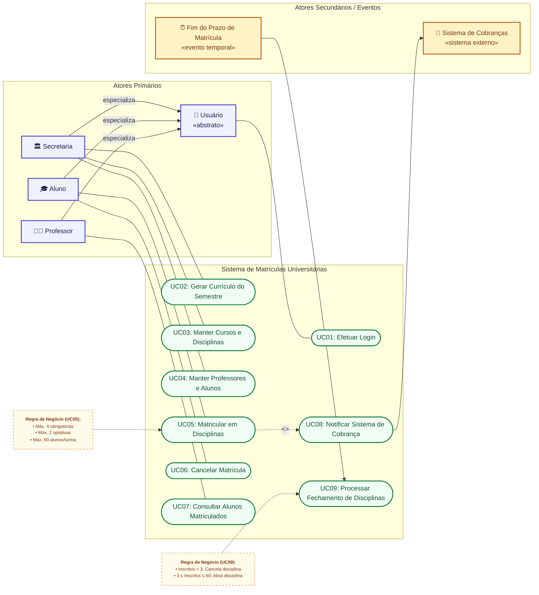
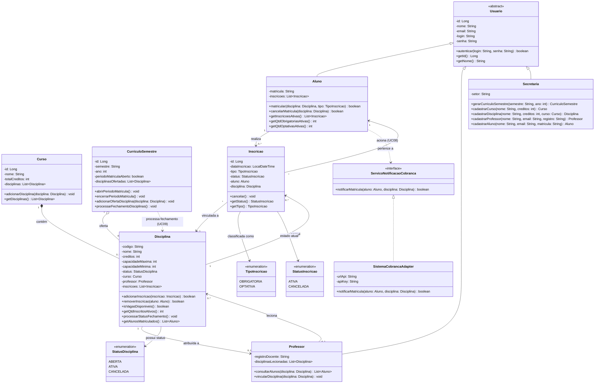

# Sistema de Matrículas Universitárias

Projeto de software desenvolvido para a disciplina **Projeto de Software (Laboratório de Desenvolvimento de Software)** do curso de Engenharia de Software da **PUC Minas**.
Paticipantes: Caio Santos e Anthony Santos
---

## 📌 Sobre o Projeto

O **Sistema de Matrículas** visa automatizar e gerenciar o processo de matrícula semestral de uma universidade. O sistema permite o gerenciamento de currículos, disciplinas, professores e alunos pela Secretaria, a seleção/cancelamento de disciplinas por parte dos alunos, a consulta de turmas pelos professores e a integração com um serviço externo de cobrança.

---

## 📄 Requisitos e Regras de Negócio Básicas

- **Perfis de Acesso**: Secretaria, Alunos e Professores. Todos necessitam de autenticação via senha.
- **Matrícula do Aluno**: Cada aluno pode se matricular em até **4 disciplinas como 1ª opção (obrigatórias)** e até **2 disciplinas alternativas (optativas)** durante o período permitido.
- **Capacidade e Status da Disciplina**:
  - **Mínimo para abertura**: Uma disciplina só se torna ativa no semestre se obtiver no mínimo **3 alunos inscritos** ao término do período de matrículas. Caso contrário, é cancelada.
  - **Capacidade máxima**: Cada disciplina comporta até **60 alunos**. Atingido esse número, as inscrições para ela são encerradas.
- **Notificação Financeira**: Após o aluno se inscrever no semestre, o **Sistema de Cobranças** é notificado automaticamente.
- **Acesso dos Professores**: Professores podem consultar quais alunos estão matriculados em cada uma de suas disciplinas.

---

## 🛠️ Tecnologias Utilizadas

- **Linguagem**: Java
- **Modelagem UML**: Diagrama de Casos de Uso e Diagrama de Classes
- **Versionamento**: Git e GitHub

---

## 📊 Modelo de Análise (Sprint 1)

### Mapeamento de Casos de Uso

1. **UC01 - Efetuar Login**: Permite que Usuários (Secretaria, Alunos e Professores) se autentiquem no sistema.
2. **UC02 - Gerar Currículo do Semestre**: Permite que a Secretaria crie e organize os cursos e disciplinas oferecidas no período letivo.
3. **UC03 - Manter Disciplinas**: Permite que a Secretaria cadastre, atualize ou remova disciplinas do catálogo.
4. **UC04 - Manter Professores e Alunos**: Permite que a Secretaria gerencie o cadastro de usuários no sistema.
5. **UC05 - Efetuar Matrícula**: Permite ao Aluno selecionar até 4 disciplinas obrigatórias e 2 optativas dentro do prazo vigente.
6. **UC06 - Cancelar Matrícula**: Permite ao Aluno remover sua inscrição de uma disciplina durante o período de matrículas.
7. **UC07 - Consultar Alunos Matriculados**: Permite ao Professor visualizar a lista de alunos inscritos em suas turmas.
8. **UC08 - Notificar Cobrança**: Processo automatizado que notifica o Sistema de Cobranças sobre a efetivação da matrícula do aluno.
9. **UC09 - Processar Validação de Disciplinas**: Regra executada ao final do período de matrícula para ativar turmas com pelo menos 3 alunos ou cancelar turmas com adesão insuficiente.

#### Diagrama de Casos de Uso (UML)

> Para mais detalhes sobre as interações e matriz de rastreabilidade, veja [docs/diagrama-de-casos-de-uso.md](docs/diagrama-de-casos-de-uso.md).

---

## 📝 Histórias de Usuário (User Stories)

### US01 - Autenticação no Sistema
**Como** Usuário do sistema (Secretaria, Aluno ou Professor),  
**Quero** me autenticar fornecendo minhas credenciais (login e senha),  
**Para que** eu possa acessar com segurança os recursos correspondentes ao meu perfil.

- **Critérios de Aceite**:
  - O acesso só é concedido mediante senha correta.
  - O sistema deve notificar em caso de falha de autenticação.

---

### US02 - Gestão de Dados Cadastrais e Currículo
**Como** membro da Secretaria,  
**Quero** cadastrar e atualizar o currículo do semestre, disciplinas, alunos e professores,  
**Para que** as informações da universidade estejam atualizadas para o período letivo.

- **Critérios de Aceite**:
  - Permitir a criação de cursos informando nome, créditos e disciplinas.
  - Permitir o cadastro de novos alunos e professores.

---

### US03 - Realização de Matrícula
**Como** Aluno,  
**Quero** me matricular em até 4 disciplinas obrigatórias e até 2 optativas no período aberto,  
**Para que** eu garanta minhas disciplinas para o próximo semestre.

- **Critérios de Aceite**:
  - O sistema deve bloquear escolhas acima do limite (máx. 4 obrigatórias + 2 optativas).
  - Quando a disciplina atingir 60 alunos matriculados, as inscrições para ela devem ser bloqueadas.
  - Ao confirmar a matrícula, o Sistema de Cobranças deve ser notificado.

---

### US04 - Cancelamento de Matrícula
**Como** Aluno,  
**Quero** cancelar a minha matrícula em disciplinas durante o período permitido,  
**Para que** eu possa reorganizar minha grade de matérias.

- **Critérios de Aceite**:
  - O cancelamento deve liberar imediatamente a vaga na disciplina.
  - Apenas matrículas dentro do prazo vigente de alterações podem ser canceladas.

---

### US05 - Validação e Fechamento de Disciplinas
**Como** Sistema de Matrículas,  
**Quero** verificar a quantidade de alunos matriculados ao término do período de inscrições,  
**Para que** disciplinas com menos de 3 alunos inscritos sejam automaticamente canceladas e as demais ativadas.

- **Critérios de Aceite**:
  - Disciplinas com menos de 3 inscritos ao final do prazo devem ter o status alterado para "Cancelada".
  - Disciplinas com 3 a 60 alunos inscritos devem ter o status alterado para "Ativa".

---

### US06 - Consulta de Turmas
**Como** Professor,  
**Quero** visualizar a relação de alunos matriculados nas disciplinas que leciono,  
**Para que** eu possa acompanhar os estudantes presentes em cada turma.

- **Critérios de Aceite**:
  - O professor visualizará apenas as disciplinas vinculadas ao seu cadastro.

---

## 📐 Projeto Estrutural (Diagrama de Classes)

Diagrama de Classes modelado a partir dos Casos de Uso (UC01 a UC09) e regras de negócio do sistema:

> Para a documentação detalhada com a especificação de métodos e relacionamentos, consulte [docs/diagrama-de-classes.md](docs/diagrama-de-classes.md).

