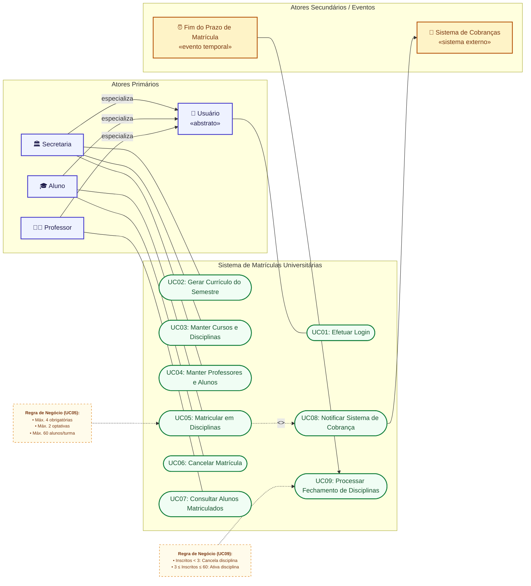

# Projeto Comportamental: Diagrama de Casos de Uso (Versão Mermaid)

## 1. Visão Geral

Este documento apresenta a versão aprimorada e nativa em **Mermaid** do **Diagrama de Casos de Uso** do Sistema de Matrículas Universitárias, complementando o diagrama original em imagem e alinhando-se aos requisitos descritos no [README.md](../README.md).

### Principais Melhorias Implementadas:
- **Renderização Nativa e Versionável**: Totalmente compatível com Markdown e visualizadores do GitHub.
- **Herança de Atores**: Modelação explícita de `Secretaria`, `Aluno` e `Professor` como especializações do ator base `Usuario`, permitindo que todos herdem a capacidade de efetuar login (`UC01`).
- **Gatilho Temporal (UC09)**: Representação do término do período de matrículas como um evento temporal/agendado que dispara o fechamento de disciplinas.
- **Notas de Regras de Negócio**: Inclusão de notas visuais ligadas diretamente a `UC05` (limites de 4 obrigatórias + 2 optativas e teto de 60 alunos) e `UC09` (mínimo de 3 alunos para ativação de disciplina).

---

## 2. Diagrama de Casos de Uso em Mermaid

---

## 3. Matriz de Rastreabilidade (Atores x Casos de Uso)

| Caso de Uso | Ator(es) Principal(is) | Tipo de Relacionamento | Descrição / Regra |
| :--- | :--- | :--- | :--- |
| **UC01: Efetuar Login** | `Usuário` (`Secretaria`, `Aluno`, `Professor`) | Associação direta | Autenticação por credenciais (login e senha). |
| **UC02: Gerar Currículo do Semestre** | `Secretaria` | Associação direta | Criação do período letivo e oferta de disciplinas. |
| **UC03: Manter Cursos e Disciplinas** | `Secretaria` | Associação direta | Cadastro, edição e remoção de cursos e disciplinas. |
| **UC04: Manter Professores e Alunos** | `Secretaria` | Associação direta | Cadastro e gerenciamento de perfis de docentes e discentes. |
| **UC05: Matricular em Disciplinas** | `Aluno` | Associação direta | Inscrição em até 4 disciplinas obrigatórias e 2 optativas (teto de 60 alunos). |
| **UC06: Cancelar Matrícula** | `Aluno` | Associação direta | Cancelamento durante o período de alterações; libera vaga imediatamente. |
| **UC07: Consultar Alunos Matriculados** | `Professor` | Associação direta | Visualização exclusiva de turmas sob responsabilidade do docente. |
| **UC08: Notificar Sistema de Cobrança** | `Sistema de Cobranças` (secundário) | `<<include>>` de UC05 | Disparo automático à API financeira após confirmação de matrícula. |
| **UC09: Processar Fechamento de Disciplinas** | `Fim do Prazo de Matrícula` (temporal) | Disparo por evento | Ativação para $\ge 3$ inscritos e cancelamento para $< 3$ inscritos. |

