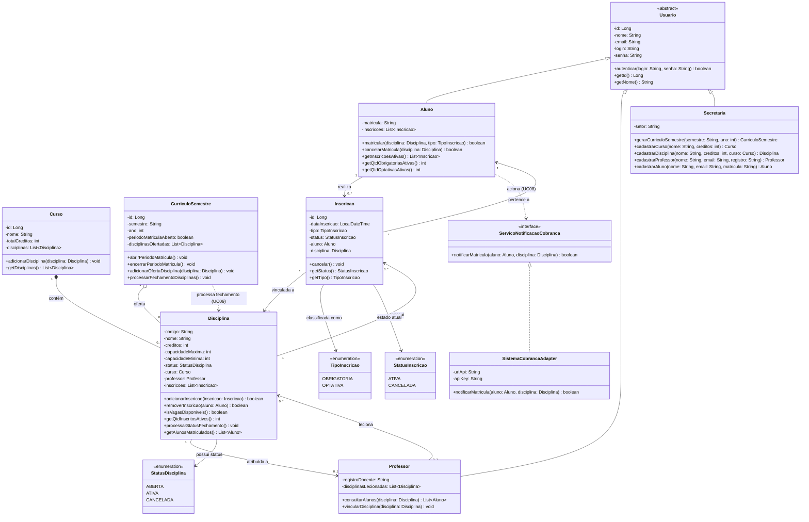

# Projeto Estrutural: Diagrama de Classes

## 1. Visão Geral

Este documento apresenta o **Projeto Estrutural (Diagrama de Classes UML)** do Sistema de Matrículas Universitárias, concebido com base nos requisitos especificados no [README.md](../README.md) e no **Diagrama de Casos de Uso** (UC01 a UC09).

---

## 2. Diagrama de Classes em Mermaid

---

## 3. Descrição Detalhada das Classes e Relacionamentos

### 3.1. Hierarquia de Usuários (UC01, UC04)
- **`Usuario` (Abstrata)**: Classe base para autenticação e dados cadastrais compartilhados (`id`, `nome`, `email`, `login`, `senha`). Possui o método `autenticar()`.
- **`Secretaria`**: Especialização que encapsula ações de administração acadêmica (UC02, UC03, UC04), como cadastrar cursos, ofertar disciplinas no semestre e gerenciar alunos e professores.
- **`Aluno`**: Especialização que realiza inscrições (UC05) e cancelamentos (UC06). Controla a regra de no máximo 4 disciplinas obrigatórias e 2 optativas.
- **`Professor`**: Especialização que leciona disciplinas e pode consultar a lista de alunos matriculados em suas turmas (UC07).

### 3.2. Estrutura Acadêmica (UC02, UC03)
- **`Curso`**: Representa um curso universitário (ex: Engenharia de Software) com seu total de créditos e catálogo de disciplinas vinculadas (composição).
- **`CurriculoSemestre`**: Representa o semestre letivo (ex: "2026/1"). Agrega as disciplinas ofertadas naquele período, controla a janela de abertura/encerramento de matrículas e dispara a rotina de validação e fechamento (UC09).
- **`Disciplina`**: Modela a disciplina/turma ofertada. Contém:
  - Capacidade mínima: 3 alunos.
  - Capacidade máxima: 60 alunos.
  - `status`: Controlado via `StatusDisciplina` (`ABERTA`, `ATIVA`, `CANCELADA`).

### 3.3. Associação e Inscrição (UC05, UC06)
- **`Inscricao`**: Classe associativa entre `Aluno` e `Disciplina`.
  - Registra a data da matrícula, o tipo (`OBRIGATORIA` ou `OPTATIVA`) e o status (`ATIVA` ou `CANCELADA`).
  - O cancelamento altera o status para `CANCELADA` e libera a vaga na disciplina imediatamente.

### 3.4. Regras de Fechamento de Turmas (UC09)
- Ao término do período de matrículas, `CurriculoSemestre.processarFechamentoDisciplinas()` percorre as disciplinas:
  - Se `inscritos >= 3`: status muda para `ATIVA`.
  - Se `inscritos < 3`: status muda para `CANCELADA`.

### 3.5. Integração com Sistema de Cobranças (UC08)
- **`ServicoNotificacaoCobranca` (Interface)** e **`SistemaCobrancaAdapter`**:
  - Implementa o padrão Adapter/Service para desacoplar o sistema acadêmico da API externa do Sistema de Cobranças.
  - É acionado automaticamente na confirmação da matrícula (UC05 `<<include>>` UC08).

